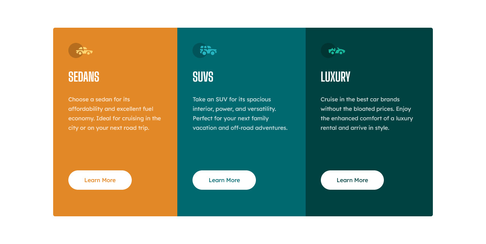

## Tabla de contenido

- [Resumen](#resumen)
  - [El reto](#el-reto)
  - [Captura de pantalla](#captura-de-pantalla)
  - [Enlaces](#enlaces)
- [Mi proceso](#mi-proceso)
  - [Construido con](#construido-con)
- [Autor](#autor)

## Visión de conjunto

### El reto

Los usuarios deben ser capaces de:

- Ver el diseño óptimo según el tamaño de pantalla de su dispositivo
- Ver estados de desplazamiento para elementos interactivos

### Captura de pantalla

### Enlaces

- URL de la solución: [https://github.com/hdlfkja/tarjeta-de-3-columnas]
- URL del sitio en vivo: [https://vista-previa-de-tarjeta-de-3-columnas.netlify.app/]

## Mi proceso

### Construido con

- Marcado HTML5 semántico
- Propiedades personalizadas de CSS
- Caja flexible
- Flujo de trabajo móvil primero

## Autor

- Frontend Mentor - [@hdlfkja](https://www.frontendmentor.io/profile/hdlfkja)
- Twitter - [@JeanCar27866009](https://twitter.com/JeanCar27866009)

